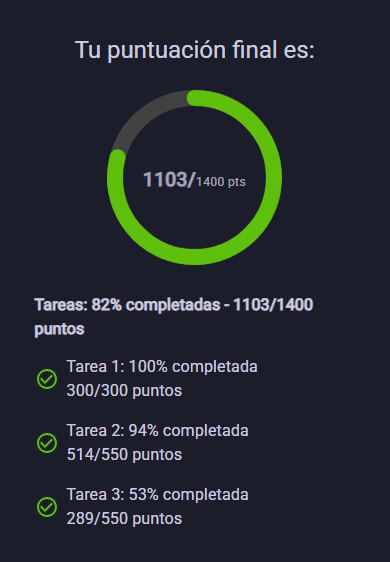
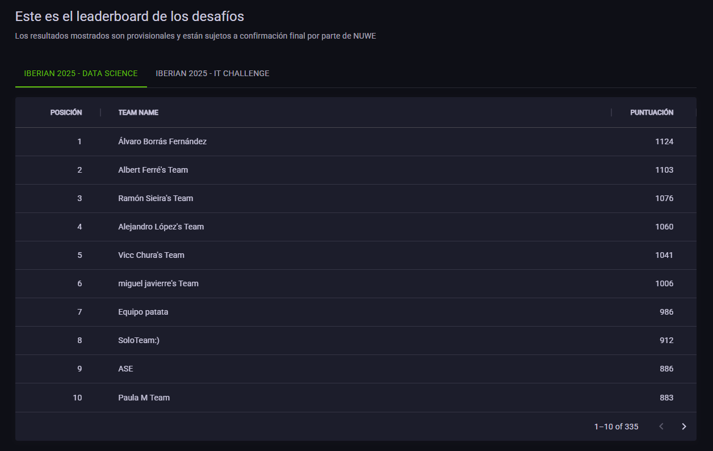

# Air Quality Insights 🏆

## 🥈 Second Place in the hackaton-schneider-pollution
This repository contains the solution that achieved **second place** in the air quality challenge organized by **Nuwe** and **Schneider Electric**.
Below are the results obtained:

### 📊 My Score


### 📌 Final Ranking



### 🏆 Challenge Details
---


# Air Quality Insights

Category   ➡️   Data Science

Subcategory   ➡️   Recommender systems

Difficulty   ➡️   Medium


---

## 🌐 Background

The challenge of energy pollution and climate action arises from the global dependency on fossil fuels, which are the primary contributors to greenhouse gas emissions. The combustion of coal, oil, and natural gas for energy production releases carbon dioxide and other harmful pollutants into the atmosphere, accelerating climate change and damaging ecosystems. As energy demand surges due to population growth and industrial development, the environmental impact intensifies. This challenge necessitates innovative solutions to transition towards cleaner energy sources, enhance energy efficiency, and implement sustainable practices. Tackling energy pollution is vital not only for mitigating climate change but also for fostering healthier communities and ensuring long-term environmental sustainability.

### 🗂️ Dataset

Three distinct datasets will be provided:

- Measurement data:
  - Variables:
    - `Measurement date`
    - `Station code`
    - `Latitude`
    - `Longitude`
    - `SO2`
    - `NO2`
    - `O3`
    - `CO`
    - `PM10`
    - `PM2.5`
 - Data available at: [Download Measurement data](https://cdn.nuwe.io/challenges-ds-datasets/hackathon-schneider-pollutant/measurement_data.zip)


- Instrument data
  - Variables:
    - `Measurement date`
    - `Station code`
    - `Item code`
    - `Average value`
    - `Instrument status` : Status of the measuring instrument when the sample was taken.
    ```json
    {
        0: "Normal",
        1: "Need for calibration",
        2: "Abnormal",
        4: "Power cut off",
        8: "Under repair",
        9: "Abnormal data",
    }
    ```
  - Data available at: [Download Instrument data](https://cdn.nuwe.io/challenges-ds-datasets/hackathon-schneider-pollutant/instrument_data.zip)

- Pollutant data
 - Variables:
    - `Item code`
    - `Item name`
    - `Unit of measurement`
    - `Good`
    - `Normal`
    - `Bad`
    - `Very bad`


### 📊 Data Processing

Perform comprehensive data processing, including filtering, normalization, and handling missing values.

Afterwards, develop two machine learning models:

- **Forecast Model:** Predict hourly air quality for specified periods, assuming no measurement errors.

- **Instrument Status Model:** Detect and classify failures in measurement instruments.

## 📂 Repository Structure
The repository structure is provided and must be adhered to strictly:

```

├── data/
│   ├── raw/
│   │   └── pollutant_data.csv
│   └── processed/
│
│── predictions/
│   ├── questions.json
│   ├── predictions_task_2.json
│   └── predictions_task_3.json
│
│── models/
│   ├── model_task_2
│   └── model_task_3
│
├── src/
│   ├── data/
│   │   ├── questions.py
│   │   └── ...
│   │
│   └── models/
│       └── (prepare your data and create the model)
│
└── README.md

```

The `/predictions` folder should contain the tasks outputs for the questions in Task 1 and the predictions for both Task 2 and Task 3.


## 🎯 Tasks
This challenge will include three tasks: an initial exploratory data analysis task with questions, followed by two model creation tasks.

#### **Task 1:** Answer the following questions about the given datasets:

**IMPORTANT** Answer the following questions considering only measurements with the value tagged as "Normal" (code 0):

  - **Q1:** Average daily SO2 concentration across all districts over the entire period. Give the station average. Provide the answer with 5 decimals.
  - **Q2:** Analyse how pollution levels vary by season. Return the average levels of CO per season at the station 209. (Take the whole month of December as part of winter, March as spring, and so on.) Provide the answer with 5 decimals.
  - **Q3:** Which hour presents the highest variability (Standard Deviation) for the pollutant O3? Treat all stations as equal.
  - **Q4:** Which is the station code with more measurements labeled as "Abnormal data"?
  - **Q5:** Which station code has more "not normal" measurements (!= 0)?
  - **Q6:** Return the count of `Good`, `Normal`, `Bad` and `Very bad` records for all the station codes of PM2.5 pollutant.


Example question output format:
```json
{"target":
  {
    "Q1": 0.11111,
    "Q2": {
        "1": 0.11111,
        "2": 0.11111,
        "3": 0.11111,
        "4": 0.11111
    },
    "Q3": 111,
    "Q4": 111,
    "Q5": 111,
    "Q6": {
        "Normal": 111,
        "Good": 111,
        "Bad": 111,
        "Very bad": 111
    }
  }
}
```

#### **Task 2:** Develop the forecasting model :
- Predict hourly pollutant concentrations for the following stations and periods, assuming error-free measurements:

````
Station code: 206 | pollutant: SO2   | Period: 2023-07-01 00:00:00 - 2023-07-31 23:00:00
Station code: 211 | pollutant: NO2   | Period: 2023-08-01 00:00:00 - 2023-08-31 23:00:00
Station code: 217 | pollutant: O3    | Period: 2023-09-01 00:00:00 - 2023-09-30 23:00:00
Station code: 219 | pollutant: CO    | Period: 2023-10-01 00:00:00 - 2023-10-31 23:00:00
Station code: 225 | pollutant: PM10  | Period: 2023-11-01 00:00:00 - 2023-11-30 23:00:00
Station code: 228 | pollutant: PM2.5 | Period: 2023-12-01 00:00:00 - 2023-12-31 23:00:00
````

Expected output format:
```json
{
  "target":
  {
    "206":
      {
        "2023-07-01 00:00:00": 0.32,
        "2023-07-01 01:00:00": 0.5,
        "2023-07-01 02:00:00": 0.8,
        "2023-07-01 03:00:00": 0.11,
        "2023-07-01 04:00:00": 0.7,
        ...
      },
    "211":
      {
        ...
      }
  }
}
```


#### **Task 3:** Detect anomalies in data measurements
Detect instrument anomalies for the following stations and periods:

````
Station code: 205 | pollutant: SO2   | Period: 2023-11-01 00:00:00 - 2023-11-30 23:00:00
Station code: 209 | pollutant: NO2   | Period: 2023-09-01 00:00:00 - 2023-09-30 23:00:00
Station code: 223 | pollutant: O3    | Period: 2023-07-01 00:00:00 - 2023-07-31 23:00:00
Station code: 224 | pollutant: CO    | Period: 2023-10-01 00:00:00 - 2023-10-31 23:00:00
Station code: 226 | pollutant: PM10  | Period: 2023-08-01 00:00:00 - 2023-08-31 23:00:00
Station code: 227 | pollutant: PM2.5 | Period: 2023-12-01 00:00:00 - 2023-12-31 23:00:00
````

Example output:
```json
{
  "target":
  {
    "205":
    {
      "2023-11-01 00:00:00": 5,
      "2023-11-01 01:00:00": 3,
      "2023-11-01 02:00:00": 6,
      "2023-11-01 03:00:00": 1,
      "2023-11-01 05:00:00": 3,
    ...
    },
    "209":
    {
      ...
    }
  }
}
```

### 💫 Guides
- Study and explore the datasets thoroughly.
- Handle missing or erroneous values.
- Normalize and scale the data.
- Implement feature engineering to improve model accuracy.


## 📤 Submission

Submit a `questions.json` file for the queries in task 1 and a `predictions_task_2.json` and `predictions_task_3.json` files containing the predictions made by your models. Ensure the files are formatted correctly and placed within the `/predictions` folder.


## 📊 Evaluation
- **Task 1:** The questions of this tasks will be evaluated via JSON file, comparing your answer in `questions.json` against the expected value.
- **Task 2:** The model will be evaluated using R2. The score will be the mean for all the station predictions.
- **Task 3:** The model will be evaluated using F1 score, using the macro average.


The grading system will be the following:

- Task 1: 300 / 1400 points
- Task 2: 550 / 1400 points
- Task 3: 550 / 1400 points

**⚠️ Please note:**
All submissions might undergo a manual code review process to ensure that the work has been conducted honestly and adheres to the highest standards of academic integrity. Any form of dishonesty or misconduct will be addressed seriously, and may lead to disqualification from the challenge.

## ❓ FAQs

#### **Q1: How do I submit my solution?**
A1: Submit your solution via Git. Once your code and predictions are ready, commit your changes to the main branch and push your repository. Your submission will be graded automatically within a few minutes. Make sure to write meaningful commit messages.
